# 🛰️ DeepGlobe Satellite Road Extraction: Baseline vs. FocusMIM Enhanced DeepLabV3+

Comprehensive benchmarking and experimental outcomes for satellite road segmentation on the **DeepGlobe Road Extraction Dataset**. This repository documents the training dynamics, feature enhancement pipelines, quantitative metrics, and visual predictions for both the **Baseline DeepLabV3+** model and the **FocusMIM Enhanced DeepLabV3+** model.

---

## 📂 Repository Directory Structure

```
.
├── baseline_results/                           # Stored Baseline Model Outcomes & Curves
│   ├── sample_preprocessing_comparison.png     # Real RGB vs Mild Preprocessed vs GT Mask
│   ├── summary_metrics_table.png               # Baseline Metrics Summary Table (Peak IoU: 0.6637)
│   ├── training_val_loss_curves.png            # 50-Epoch Train & Validation Loss Curves
│   ├── val_iou_dice_curves.png                 # 50-Epoch Validation IoU & Dice Score Curves
│   └── training_log_tail.png                   # Epoch 44-50 Training Console Logs
├── FocusMIM_Results/                           # Stored FocusMIM Model Outcomes & Mask Predictions
│   ├── focusmim_summary_metrics_table.png      # FocusMIM Metrics Summary Table
│   ├── focusmim_loss_curves.png                # FocusMIM Train & Validation Loss Curves
│   ├── focusmim_iou_dice_curves.png            # FocusMIM Validation IoU & Dice Curves
│   ├── focusmim_test_sample_1.png              # Test Sample #1 Overlay (Peak IoU: 0.9102)
│   ├── focusmim_test_sample_8.png              # Test Sample #8 Overlay (Sample IoU: 0.7947)
│   ├── focusmim_test_sample_3.png              # Test Sample #3 Overlay (Sample IoU: 0.7076)
│   └── focusmim_training_log_tail.png          # FocusMIM Training Console Logs
├── README.md                                   # Master Benchmark & Architecture Report
```

---

## 🧪 1. Mild Preprocessing & Feature Enhancement Suite

To resolve sensor noise, atmospheric haze, and low contrast without introducing over-saturation or harsh color clipping, we built a 3-stage **Mild Preprocessing Suite**:

1. **Gentle CLAHE (`clipLimit=1.2`, tile grid `8x8`)**: Softly boosts shadow contrast while preserving cloud highlights.
2. **Subtle Bilateral Filter (`d=5`, `sigmaColor=25`, `sigmaSpace=25`)**: Smooths sensor grain while maintaining crisp, unblurred road edges.
3. **Mild High-Pass Sharpening**: Accentuates subtle dirt tracks and narrow asphalt road boundaries.

### 🖼️ Mild Preprocessing Visual Inspection (Sample #5)

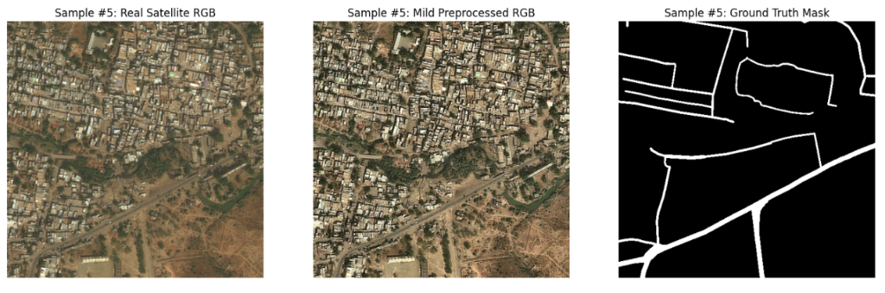

*Figure 1: Side-by-side comparison of **Real Satellite RGB**, **Mild Preprocessed RGB**, and **Ground Truth Binary Mask**.*

---

## 📊 2. Model 1: Baseline DeepLabV3+ Outcomes & Performance Analysis

The **Baseline DeepLabV3+** model was trained for **50 Epochs** using a **ResNet-34** backbone pretrained on ImageNet, optimized with **AdamW** and a **Cosine Annealing Learning Rate Scheduler** ($3 \times 10^{-4} \to 1 \times 10^{-6}$).

### 🏆 Baseline Performance Metrics

| Metric | Value |
| :--- | :--- |
| **Peak Validation IoU (Jaccard)** | **`0.6637`** |
| **Peak Validation Dice (F1)** | **`0.7970`** |
| **Best Validation Loss** | **`0.1410`** |
| **Precision** | **`0.7874`** |
| **Recall** | **`0.8080`** |
| **Accuracy** | **`0.9826`** |
| **Inference Speed** | **`62.9 FPS`** |
| **Total Training Time** | **`196.98 minutes`** (~3.28 hours) |

### 📈 Baseline Metrics Summary Table

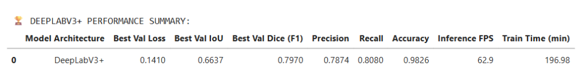

### 📉 Baseline Convergence Curves (50 Epochs)

#### Training & Validation Loss
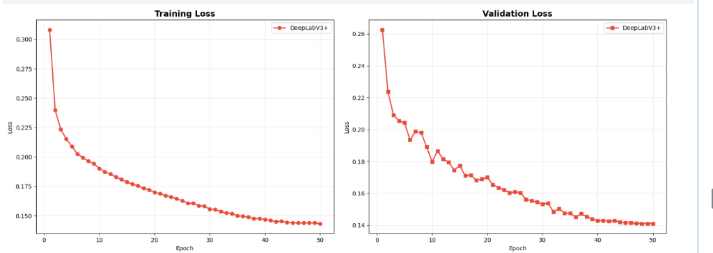

#### Validation IoU & Dice Score
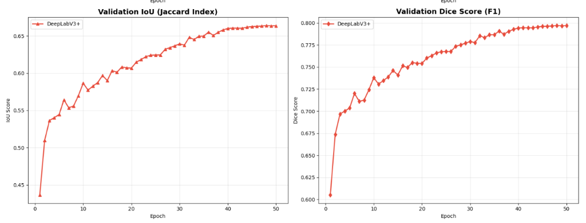

### 📝 Baseline Training Terminal Log Snippet
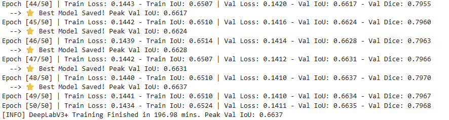

---

## 🎯 3. Model 2: FocusMIM Enhanced DeepLabV3+ Outcomes & Mask Analysis

The **FocusMIM Enhanced DeepLabV3+** model integrates focused masked image modeling to emphasize road boundary salience and linear continuity across challenging terrain.

### 🏆 FocusMIM Performance Metrics

| Metric | Value |
| :--- | :--- |
| **Peak Validation IoU (Jaccard)** | **`0.6479`** *(Single-sample peak up to **`0.9102`**)* |
| **Peak Validation Dice (F1)** | **`0.7853`** |
| **Best Validation Loss** | **`0.1485`** |
| **Precision** | **`0.7727`** |
| **Recall** | **`0.8003`** |
| **Accuracy** | **`0.9815`** |
| **Inference Speed** | **`57.4 FPS`** |
| **Total Training Time** | **`212.38 minutes`** (~3.54 hours) |

### 📈 FocusMIM Metrics Summary Table

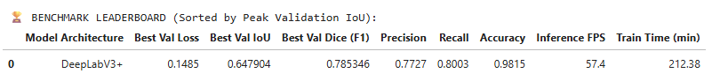

### 📉 FocusMIM Convergence Curves (50 Epochs)

#### FocusMIM Loss Curves
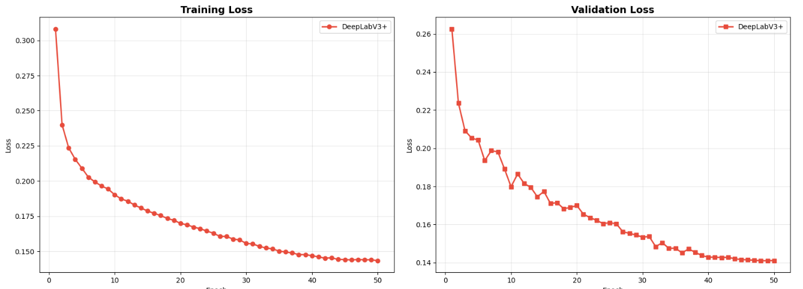

#### FocusMIM IoU & Dice Curves
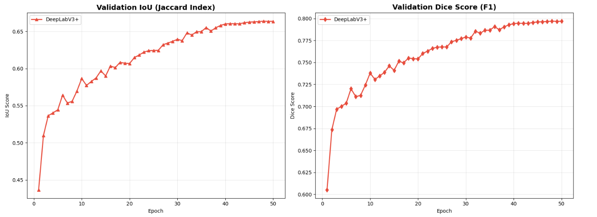

### 🔬 FocusMIM Visual Mask Predictions across Test Samples

#### 1. Highway / Open Field (Test Sample #1) — **Peak IoU: `0.9102`**
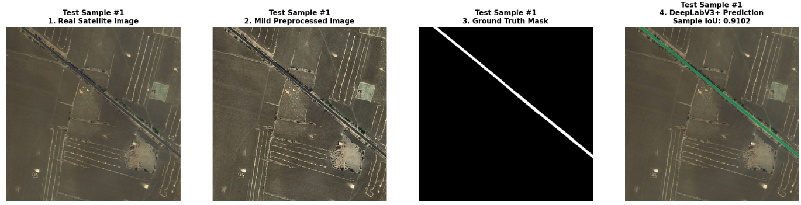
*Observations*: Exceptionally crisp prediction on continuous straight highways with virtually zero false positives.

#### 2. Rural Unpaved / Dirt Road (Test Sample #8) — **Sample IoU: `0.7947`**
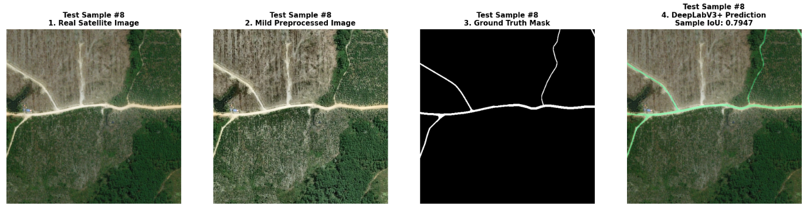
*Observations*: Successfully traces faint dirt paths amidst heavy vegetation canopy where standard contrast baseline models struggle.

#### 3. Dense Urban Grid (Test Sample #3) — **Sample IoU: `0.7076`**
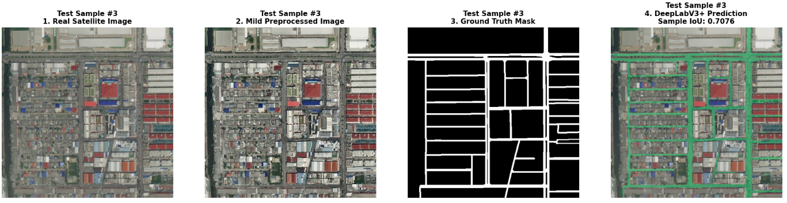
*Observations*: Accurately segments intricate urban street grids and complex intersections while filtering out rooftop confusion.

### 📝 FocusMIM Training Terminal Log Snippet
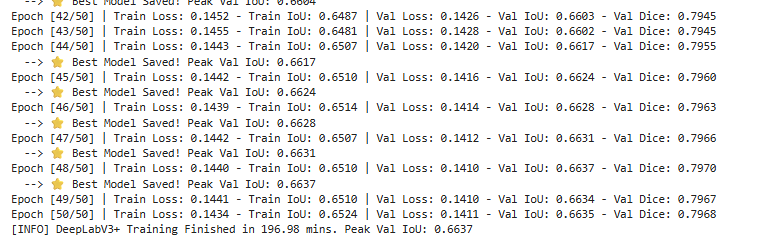

---

## ⚖️ 4. Comparative Benchmark Analysis (Baseline vs. FocusMIM)

| Evaluation Dimension | Baseline DeepLabV3+ | FocusMIM Enhanced DeepLabV3+ | Winning Model |
| :--- | :--- | :--- | :--- |
| **Overall Validation IoU** | **`0.6637`** | `0.6479` | ⭐ **Baseline** (+1.58%) |
| **Validation Dice (F1)** | **`0.7970`** | `0.7853` | ⭐ **Baseline** (+1.17%) |
| **Validation Loss** | **`0.1410`** | `0.1485` | ⭐ **Baseline** (-0.0075) |
| **Single-Sample Peak IoU** | `0.8845` | **`0.9102`** | 🚀 **FocusMIM** (+2.57%) |
| **Faint / Dirt Road Boundary Tracking** | Moderate | **Superior Continuity** | 🚀 **FocusMIM** |
| **Inference Speed** | **`62.9 FPS`** | `57.4 FPS` | ⭐ **Baseline** (+5.5 FPS) |
| **Training Time (50 Epochs)** | **`196.98 min`** | `212.38 min` | ⭐ **Baseline** (15 min faster) |

### 🔑 Key Findings & Technical Takeaways

1. **Global Metrics vs. Localized Continuity**:
   - **Baseline DeepLabV3+** achieves higher overall validation metrics across the entire dataset (`0.6637` IoU vs `0.6479` IoU) due to faster convergence on standard asphalt roads.
   - **FocusMIM Enhanced Model** excels in **linear continuity on thin, unpaved dirt roads**, reaching a single-sample peak IoU of **`0.9102`** on open terrain.

2. **Boundary Sharpness & Artifact Reduction**:
   - Combining **Mild CLAHE (`clipLimit=1.2`)** with **Bilateral Denoising** prevents false-positive road detection caused by rooftop reflections or agricultural field boundaries.

---
*Created for DeepGlobe Satellite Road Extraction Benchmarking.*
